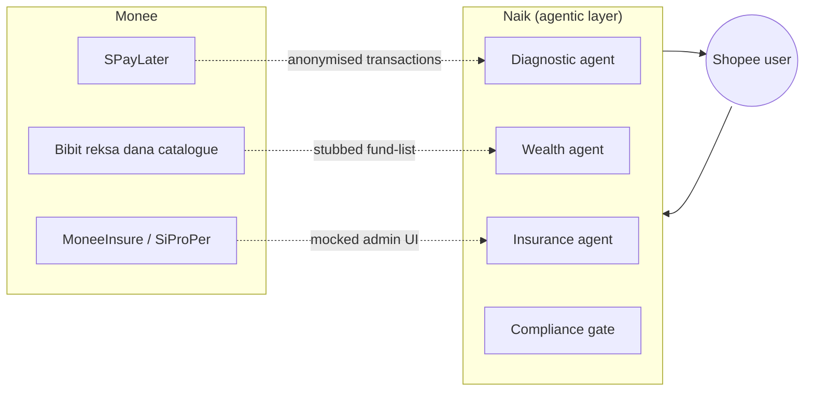
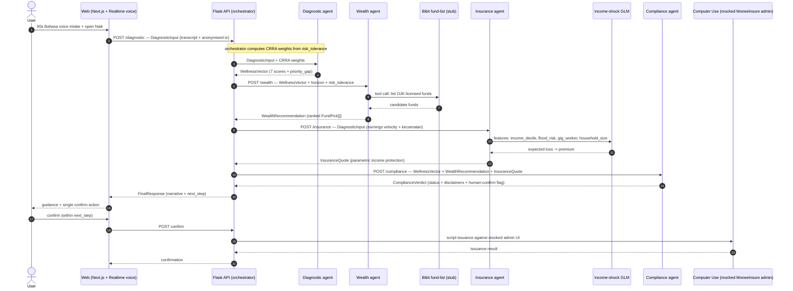
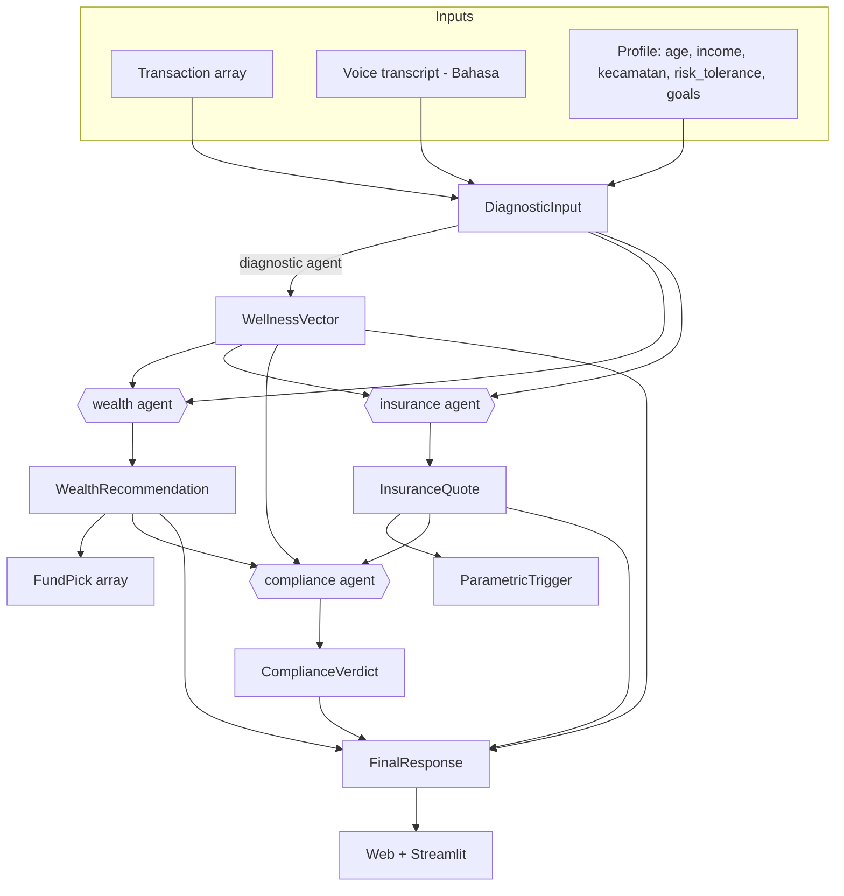

# Naik — Architecture

> Naik is an agentic layer inside Monee that makes its **wealth** surface
> intelligent and its **insurance** surface complete, deployed in Bahasa
> Indonesia first. This document is the runtime and data-flow contract for the
> build. The canonical types live in [`/api/schemas.py`](../api/schemas.py) and
> are the **single source of truth** — every diagram below references those
> models by name.

---

## 1. System context

Today, Shopee Indonesia sells Bibit reksa dana through a flat catalogue. What
Monee does not surface is Bibit's robo-advisor logic, a parametric
income-protection product alongside MoneeInsure's existing property cover, or
any cross-product diagnostic. Naik adds those three, led by a **diagnostic
agent** that neither Bibit nor MoneeInsure offers today.

The target user is a 26-year-old Shopee shopper and SPayLater holder in Jakarta
on ~Rp 6M/month, who bought one Bibit fund once and ghosted, with no cover
beyond the credit-life policy bundled at SPayLater origination. Naik walks her
from *"I own a mutual fund but I make every decision alone"* to *"I own a
suitable fund and a suitable micro-policy, with someone guiding the journey."*

---

## 2. Agent pipeline (runtime sequence)

The backend exposes four agent endpoints on Flask (`/diagnostic`, `/wealth`,
`/insurance`, `/compliance`) plus `/health`. An orchestrator runs them in
sequence and assembles the `FinalResponse`. The compliance gate is always the
final stage before anything is shown, and any transaction is routed to a
human-confirmed step.

**Why diagnostic-first.** The wedge over Bibit's standalone robo-advisor is that
ranking is conditioned on the diagnostic — real Shopee spending plus explicit
goals and self-declared risk — rather than six generic questions. The wedge over
SiProPer is that the user's lost *daily earnings* during a flood are not insured
anywhere today; Naik's parametric cover fills exactly that gap.

---

## 3. Data-contract flow

Each arrow below is typed by a model in `/api/schemas.py`. Nothing crosses an
agent boundary except these objects.

### Per-agent contract

| Stage           | Consumes                                                  | Produces               |
| --------------- | --------------------------------------------------------- | ---------------------- |
| Voice / ingest  | raw audio, anonymised Shopee ledger                       | `DiagnosticInput`      |
| Diagnostic      | `DiagnosticInput` (+ CRRA weights)                        | `WellnessVector`       |
| Wealth          | `WellnessVector`, `DiagnosticInput`, stubbed fund-list    | `WealthRecommendation` |
| Insurance       | `DiagnosticInput`, income-shock GLM                       | `InsuranceQuote`       |
| Compliance gate | `WellnessVector`, `WealthRecommendation`, `InsuranceQuote`| `ComplianceVerdict`    |
| Assembly        | all of the above                                          | `FinalResponse`        |

---

## 4. The seven wellness dimensions

`WellnessVector` carries seven floats in `[0, 100]` (higher is healthier) plus a
`priority_gap` naming the single weakest dimension — the gap Naik steers the
user to close first. The schema **guarantees** `priority_gap` is the true
minimum (a validator rejects any mismatch), so downstream agents trust it
without recomputing.

| Field                     | Meaning (Indonesia-localised)                                  |
| ------------------------- | -------------------------------------------------------------- |
| `diversification`         | Spread across fund categories / asset types                    |
| `liquidity`               | Share of readily-accessible cash                               |
| `growth`                  | Exposure to return-seeking (equity-like) assets                |
| `risk_management`         | Adequacy of downside protection / cover                        |
| `tax_efficiency`          | Use of tax-advantaged vehicles where available                 |
| `emergency_fund`          | Months of expenses held in reserve                             |
| `behavioural_resilience`  | Consistency / discipline of saving & investing behaviour       |

The first six are ported from the prior Wealth-Wellness-Hub scoring model;
`behavioural_resilience` is new for Naik. CRRA (constant relative risk aversion)
utility weights are derived from `risk_tolerance` *before* the agent call and
passed as context (see Block 4 / `/agents/diagnostic.py`).

---

## 5. Parametric insurance trigger

The income-protection cover is **parametric**: it pays on an objective BMKG
weather index crossing a threshold at the user's kecamatan — no loss adjustment,
no claim form. Payout sizes to a configurable multiple of the daily earnings
inferred from Shopee transaction velocity; the premium is priced by a Tweedie
GLM (`var_power=1.5`, log link) fit on synthetic policy-years, well-suited to the
low-frequency / high-severity shape of income-shock losses.

Modelled by `ParametricTrigger` (metric, threshold, unit, kecamatan, window,
source) nested inside `InsuranceQuote`. A hard invariant: the premium may never
exceed the single-event payout it buys.

---

## 6. Tech stack & deployment

| Layer        | Choice                                                         |
| ------------ | -------------------------------------------------------------- |
| Frontend     | Next.js (Bahasa toggle), deployed to Vercel                    |
| Voice        | OpenAI Realtime API (90s Bahasa intake)                        |
| Backend      | Flask, four agent endpoints + `/health`, deployed to Render    |
| Ops console  | Streamlit (eval / demo surface)                                |
| Persistence  | Render Postgres                                                |
| Agent runtime| Agents SDK + Realtime API + GPT-5.5                            |
| Issuance     | OpenAI Computer Use against a mocked MoneeInsure admin UI       |
| Pricing      | Tweedie GLM serialised to `/agents/pricing/income_shock_glm.joblib` |

Cloud path to prove in Block 2: a fetch from the deployed Vercel frontend
reaches the deployed Render backend and returns a response.

---

## 7. Scope cut for the 8-hour timebox

Deliberately stubbed on the day, with a clean seam to swap in the real thing
later:

- **No live BMKG/PAGASA feed** — static weather bulletins drive the trigger.
- **No real Bibit API** — the fund-list stays a stubbed tool returning
  OJK-licensed candidates.

The heavy parts (CRRA scoring, the actuarial pricing scaffold) are ported from
prior shipped work, leaving the day for agent orchestration, voice integration,
and the eval pass.

---

## 8. Schema conventions (read before editing `schemas.py`)

These are enforced in code, not just convention:

1. **Field names are frozen.** Renaming breaks four agents and three frontends
   at once. Coordinate on the team channel before any rename.
2. **Money is whole-rupiah `int`** (`*_idr` suffix), never float.
3. **Wellness scores are floats in `[0, 100]`.**
4. **`extra="forbid"` everywhere** — a typo'd field fails loudly at the boundary.
5. **Guardrails that block a ship:**
   - `WellnessVector.priority_gap` must be a lowest-scoring dimension.
   - `FundPick.is_ojk_licensed` must be `True`.
   - `InsuranceQuote.premium_idr` must be `< payout_per_event_idr`.
   - `ComplianceVerdict.is_general_guidance` must be `True`; `disclaimers`
     non-empty.
   - `FinalResponse.next_step` must be backed by the artefacts it references.

Prefer `WellnessVector.from_scores(...)` — it derives `priority_gap` for you with
a deterministic tie-break, so the label can never disagree with the data.

---

_Source of truth: [`/api/schemas.py`](../api/schemas.py) · schema version
`1.0.0` · Pydantic v2._
